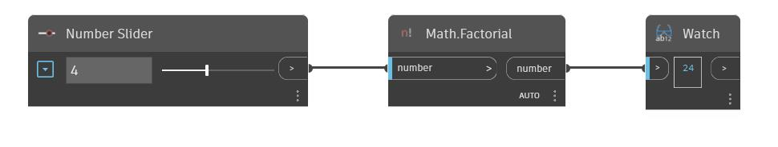

## In profondità
Factorial restituirà il valore fattoriale di un numero intero positivo di input. Se viene inserito un valore decimale, il valore fattoriale eseguirà prima l'arrotondamento dell'input al numero intero più vicino. Nell'esempio seguente, viene utilizzato un Number Slider per controllare l'input per un nodo Factorial.
___
## File di esempio

