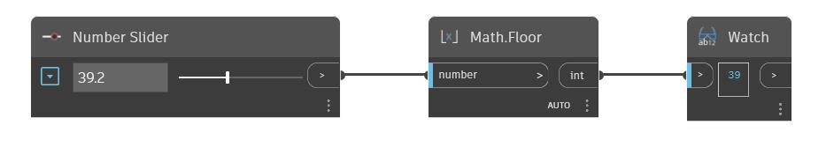

## In profondità
Floor troverà il numero intero più vicino che è minore di un numero di input. Ciò può anche essere considerato come arrotondamento al numero intero più vicino. Nell'esempio seguente, si utilizza un Number Slider per controllare l'input per un nodo Floor.
___
## File di esempio

