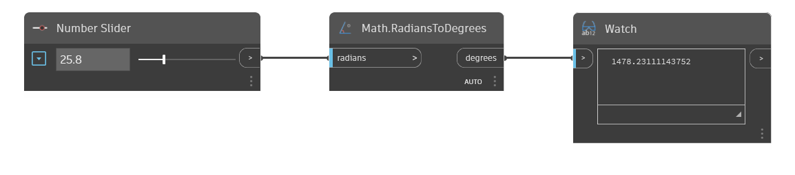

## In profondità
Math.RadiansToDegrees convertirà un angolo di input da radianti in gradi. Nell'esempio seguente, si utilizza un Number Slider per controllare l'angolo di input in un nodo RadiansToDegrees.
___
## File di esempio

