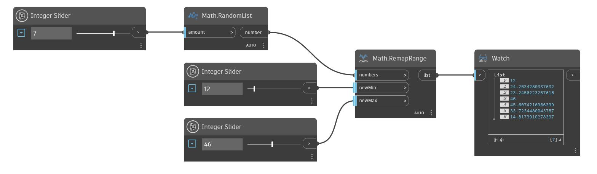

## In profondità
RemapRange utilizzerà un elenco di numeri e produrrà una scala lineare di tali numeri in un nuovo intervallo specificato. Il valore minimo dell'elenco originale viene associato all'input newMin, mentre il valore massimo dell'elenco originale viene associato all'input newMax. I numeri rimanenti vengono adattati in scala per mantenere il rapporto di distribuzione. Nell'esempio seguente, si utilizza un nodo RandomList per generare un elenco di numeri da riassociare. Si utilizzano due Number Slider per controllare i nuovi valori minimo e massimo dell'elenco risultante.
___
## File di esempio

