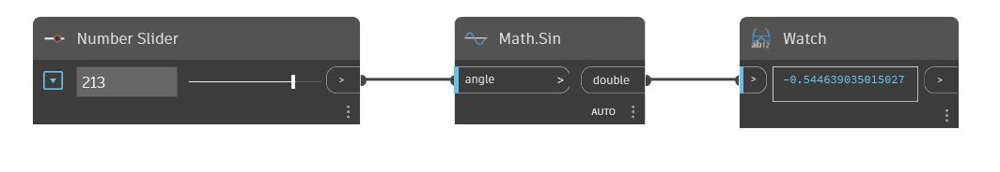

## In profondità
Sin restituirà il seno di un angolo di input in gradi. Nell'esempio seguente, si utilizza un Number Slider impostato sull'intervallo compreso tra -360 e 360 per controllare l'angolo di input per un nodo Sin.
___
## File di esempio

