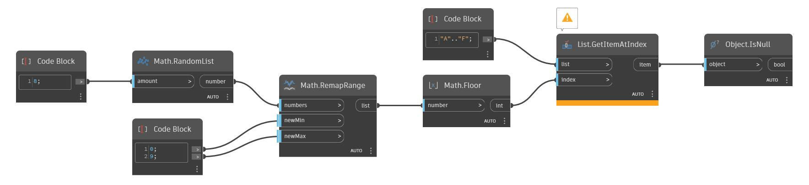

## In profondità
IsNull restituirà un valore booleano a seconda del fatto che un oggetto sia o meno null. Nell'esempio seguente, viene disegnata una griglia di cerchi con raggi variabili in base al livello Red in una bitmap. Se non è presente un valore Red, non viene disegnato alcun cerchio e viene restituito null nell'elenco di cerchi. Facendo passare questo elenco attraverso IsNull viene restituito un elenco di valori booleani, con true che rappresenta ogni posizione di un valore null. È possibile utilizzare questo elenco di valori booleani con List.FilterByBoolMask per restituire un elenco senza valori null.
___
## File di esempio

