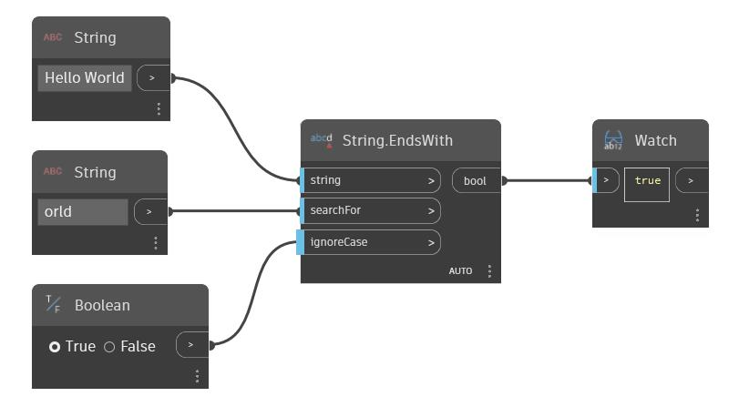

## In profondità
EndsWith restituirà un valore booleano a seconda che una determinata stringa termini con una seconda stringa di input. Per default, questo nodo fa distinzione tra maiuscole e minuscole. È possibile utilizzare un valore booleano nell'input "ignoreCase" per fare in modo che il nodo ignori la distinzione tra maiuscole e minuscole nelle stringhe. Nell'esempio seguente, si utilizza la stringa "Hello World" come stringa originale e si utilizza una seconda stringa "orld" come stringa da cercare. Poiché "Hello World" termina nella stringa "orld", il nodo EndsWith restituisce true.
___
## File di esempio

