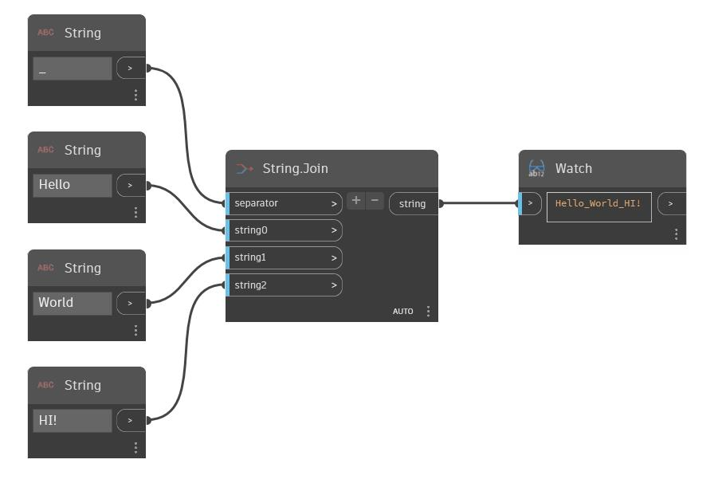

## In profondità
Join concatenerà una serie di stringhe in una singola stringa utilizzando una singola stringa separatore specificata tra di esse. Nell'esempio seguente, viene utilizzato un carattere di sottolineatura come separatore. Vengono create tre stringhe da concatenare. Il numero di input string che il nodo accetta può essere modificato utilizzando i pulsanti '+' e '-' sul nodo.
___
## File di esempio

