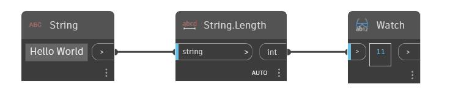

## In profondità
Length restituisce la lunghezza del contorno di un pannello di facciata continua come double. Si può utilizzare anche se il pannello di facciata continua non è rettangolare.
___
## File di esempio

