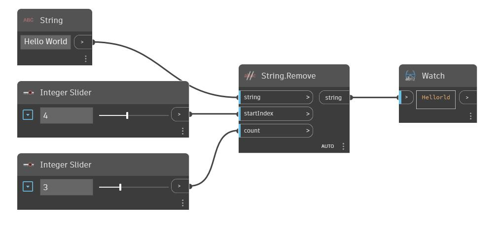

## In profondità
Remove utilizza una stringa come input e rimuoverà i caratteri da tale stringa a partire dall'input "startIndex". Il numero di caratteri da rimuovere è specificato dall'indice "count". Nell'esempio seguente, si inizia con la stringa "Hello World". Vengono utilizzati due Integer Slider per controllare startIndex e il conteggio di caratteri da rimuovere da un nodo Remove.
___
## File di esempio

