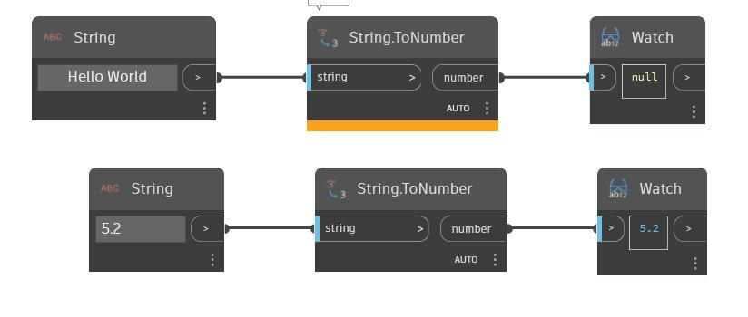

## In profondità
ToNumber convertirà una stringa di input in un tipo di dati numerici. Questo nodo richiede una stringa con il formato di un numero. Nell'esempio seguente, è possibile vedere che la stringa "Hello World" non può essere convertita in un numero, mentre la stringa "5.2" può essere convertita nel numero 5.2.
___
## File di esempio

