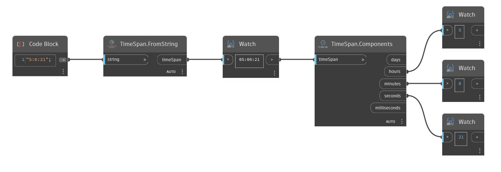

## In profondità
FromString restituirà un TimeSpan da un valore String. Nell'esempio seguente, un valore String "5:6:21" restituirà un TimeSpan di 5 ore, 6 minuti e 21 secondi.
___
## File di esempio

