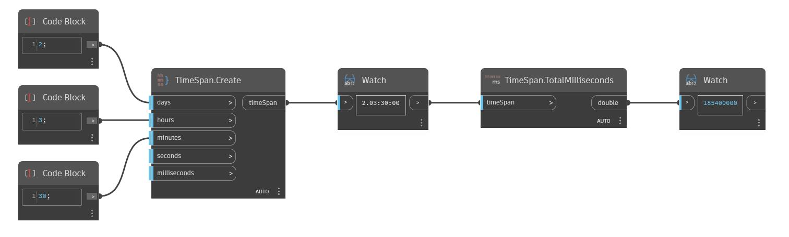

## In profondità
TotalMilliseconds restituirà il numero di millisecondi in un TimeSpan come double. Nell'esempio seguente, il numero totale di millisecondi restituiti da TimeSpan 2.03:00:00 è 185400000.
___
## File di esempio

