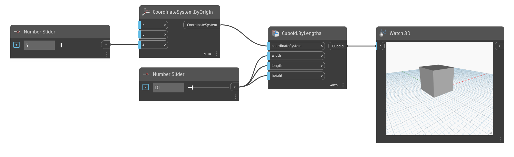

<!--- Autodesk.DesignScript.Geometry.Cuboid.ByLengths(coordinateSystem, width, length, height) --->
<!--- E62L7SP5TZLSFZF6WG4XDSUMT7PBFAQVFDFOPSRAP7JMXBUTQM3Q --->
## In profondità
Cuboid.ByLengths (coordinateSystem, width, length, height) creerà un oggetto cuboide in corrispondenza del sistema di coordinate specificato con le quote specificate. Se il sistema di coordinate di input viene spostato, anche il cuboide si sposterà in base al sistema di coordinate.
___
## File di esempio

