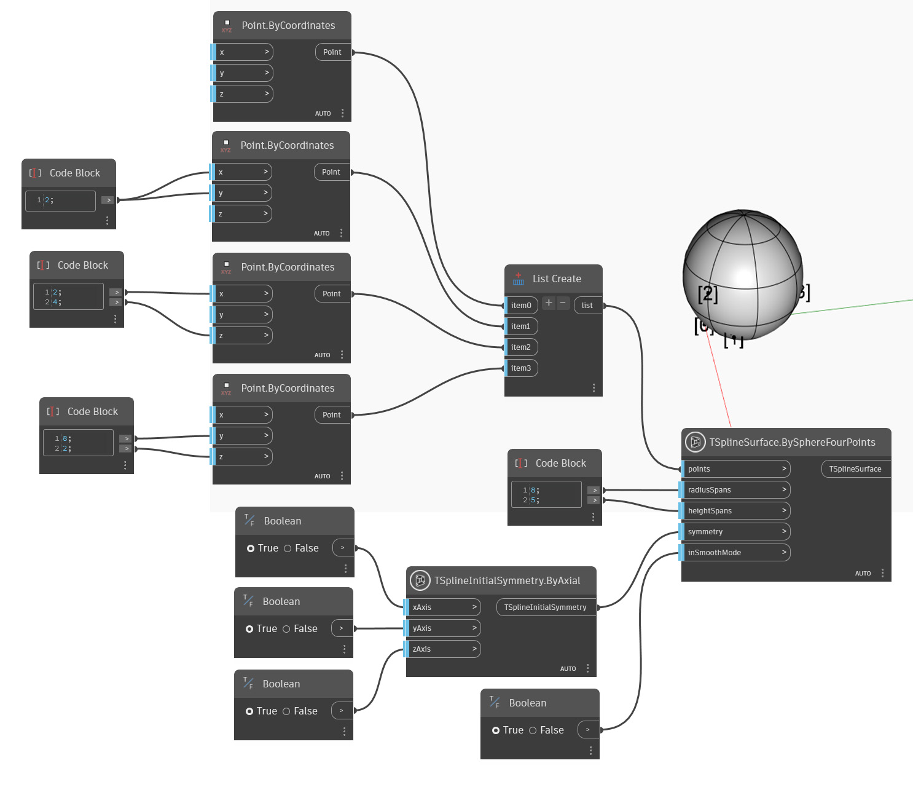

<!--- Autodesk.DesignScript.Geometry.TSpline.TSplineSurface.BySphereFourPoints --->
<!--- GLX34N2BPR4CQLUZBB4FTQ47NECC2T5CQ6KSRZQXSOY6HIHL5YGQ --->
## In-Depth
Nell'esempio seguente, una superficie della primitiva della sfera T-Spline viene creata dai quattro punti specificati utilizzando il nodo `TSplineSurface.BySphereFourPoints`. Gli input `radiusSpans` e `heightSpans` controllano il numero di facce lungo le campate di altezza e radiali (o i meridiani). `symmetry` controlla se la forma ha la simmetria iniziale e infine `inSmoothMode` definisce se l'anteprima è in modalità uniforme o riquadro.

## File di esempio

