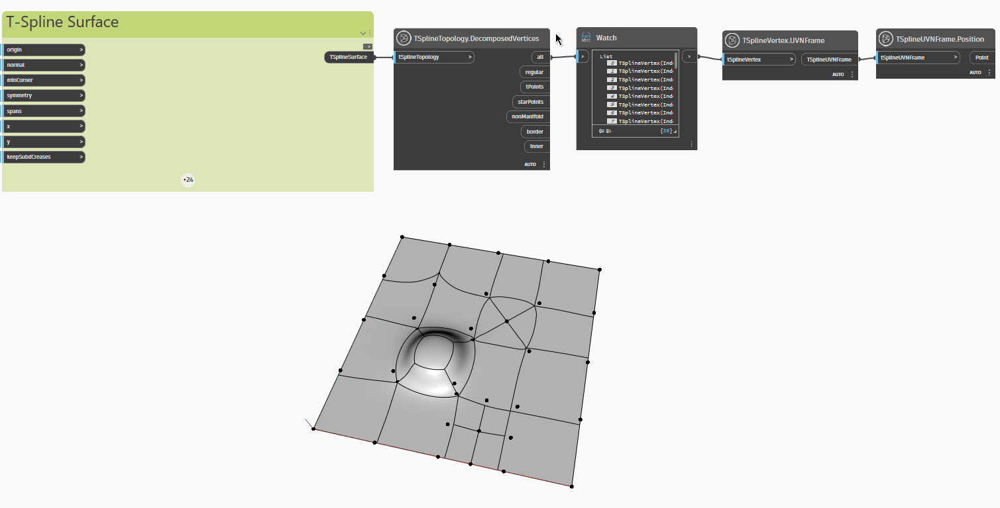

<!--- Autodesk.DesignScript.Geometry.TSpline.TSplineTopology.DecomposedVertices --->
<!--- GNCPW2XCPOITIUUDNZKISNP347TEGTDWVI5SQTBJX3JWFZTVRXGA --->
## In profondità
Nell'esempio seguente, una superficie T-Spline piana con facce e vertici estrusi, suddivisi ed estratti viene ispezionata con il nodo `TSplineTopology.DecomposedVertices`, che restituisce un elenco dei seguenti tipi di vertici contenuti nella superficie T-Spline:

- `all`: elenco di tutti i vertici
- `regular`: elenco di vertici regolari
- `tPoints`: elenco di vertici dei punti a T
- `starPoints`: elenco di vertici dei punti a stella
- `nonManifold`: elenco di vertici non manifold
- `border`: elenco di vertici dei bordi
- `inner`: elenco di vertici interni

I nodi `TSplineVertex.UVNFrame` e `TSplineUVNFrame.Position` vengono utilizzati per evidenziare i diversi tipi di vertici della superficie.

___
## File di esempio

