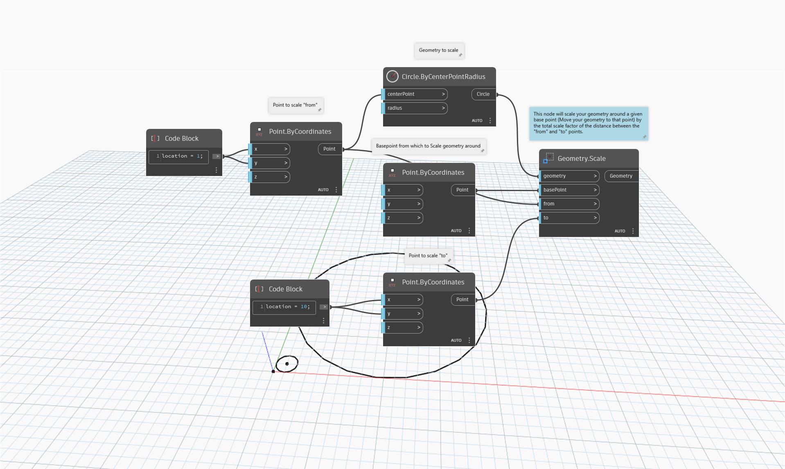

<!--- Autodesk.DesignScript.Geometry.Geometry.Scale(geometry, basePoint, from, to) --->
<!--- GYGTDRZBKUXMUX6NHZN4KHZ5XUBTIO3F5BLLADD7ADVJ2SMJZLCA --->
## In profondità
`Geometry.Scale (geometry, basePoint, from, to)` mette in scala la geometria data attorno al punto specificato in base al fattore di scala totale della distanza tra i punti di input `from` e `to`.

Nell'esempio seguente, un cerchio viene spostato e la relativa dimensione viene aumentata.
___
## File di esempio

