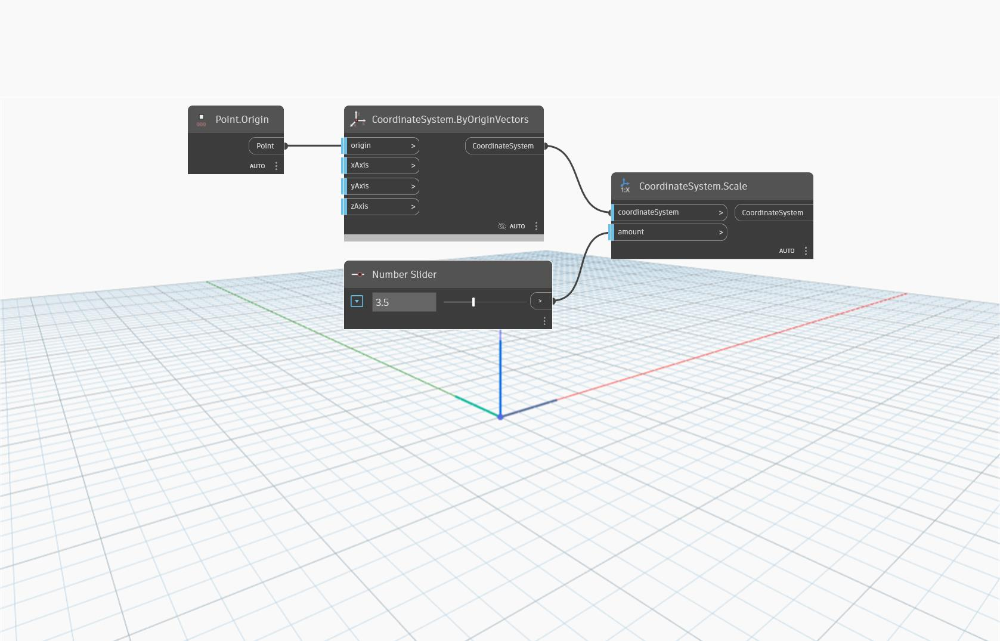

<!--- Autodesk.DesignScript.Geometry.CoordinateSystem.Scale(coordinateSystem, amount) --->
<!--- LH2OMC6QECNGXILBERSJIZPNQ7BJYOSSOBDJC2VICMMYXJ7BJRUA --->
## In profondità
`CoordinateSystem.Scale (coordinateSystem, amount)` restituisce un nuovo CoordinateSystem scalato di un fattore.

Nell'esempio seguente, un CoordinateSystem in corrispondenza dell'origine viene scalato di un fattore pari a 3.5. Il CoordinateSystem risultante presenta lunghezze vettoriali e fattori di scala pari a 3.5. Regolare il dispositivo di scorrimento per i diversi fattori di scala.
___
## File di esempio

