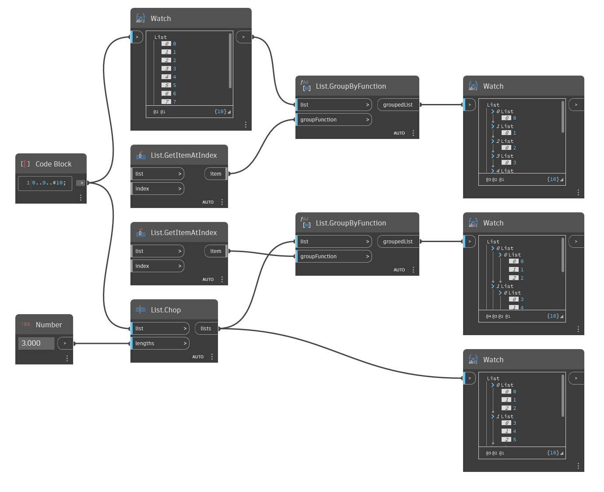

## In profondità
`List.GroupByFunction` restituisce un nuovo elenco raggruppato in base ad una funzione.

L'input `groupFunction` richiede un nodo in uno stato funzione (ovvero, restituisce una funzione). Ciò significa che almeno uno degli input del nodo non è connesso. Dynamo esegue quindi la funzione del nodo su ogni elemento dell'elenco di input di `List.GroupByFunction` per utilizzare l'output come meccanismo di raggruppamento.

Nell'esempio seguente, vengono raggruppati due elenchi diversi utilizzando `List.GetItemAtIndex` come funzione. Questa funzione crea gruppi (un nuovo elenco) da ciascun indice di livello superiore.
___
## File di esempio

