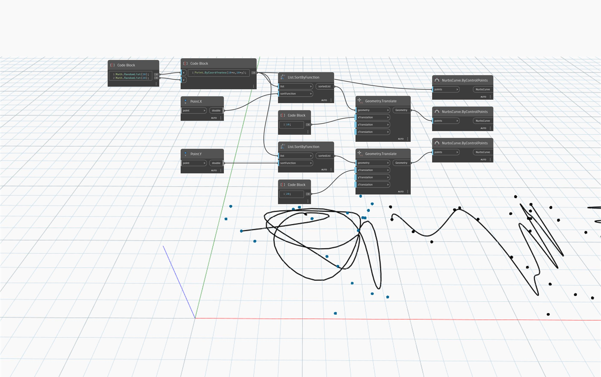

## In profondità
`List.SortByFunction` restituisce un elenco ordinato in base ad una funzione.

Nell'esempio seguente, viene disegnata una linea attraverso un elenco di punti posizionati in modo casuale che sono stati ordinati con funzioni diverse. La prima curva attraverso un elenco non ordinato è non direzionale. Ordinando l'elenco mediante il componente X o Y di ogni punto, si ottengono linee direzionali che si estendono rispettivamente lungo X e Y.
___
## File di esempio

