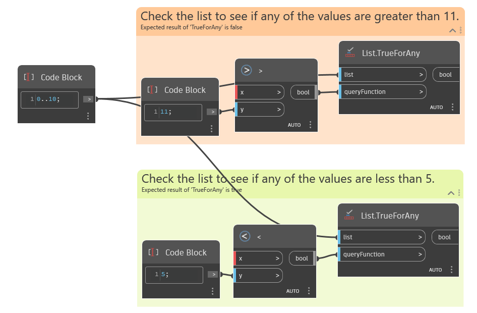

## In profondità
`List.TrueForAny` restituisce un valore booleano che indica se la condizione nell'input `queryFunction` è True per almeno un elemento dell'elenco. L'input `queryFunction` deve essere un valore booleano.

Nell'esempio seguente sono illustrate due funzioni utilizzate per valutare un elenco di input. La prima funzione utilizza un nodo con il segno di maggiore di (>) per valutare se uno qualsiasi dei valori dell'elenco è maggiore di 11, il che restituisce False. La seconda funzione utilizza un nodo con il segno di minore di (<) per valutare se uno qualsiasi dei valori dell'elenco è minore di 5, il che restituisce True.
___
## File di esempio

