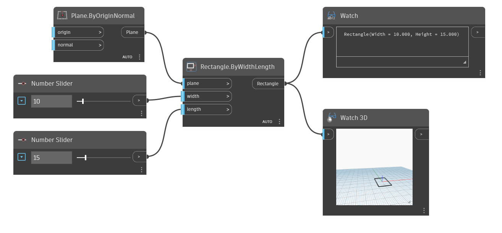

<!--- Autodesk.DesignScript.Geometry.Rectangle.ByWidthLength(plane, width, length) --->
<!--- MNNWHJCYE2KIJHONO2J56LQNPLRQZZARI7KF2BP4OJ6BRWGDXPAQ --->
## In profondità
Crea un rettangolo centrato in corrispondenza dell'origine del piano di input, con larghezza (lunghezza dell'asse X) e lunghezza (lunghezza dell'asse Y) specificate. Nell'esempio, si utilizza il piano YZ globale come piano di input. La larghezza specifica la lunghezza dell'asse X del piano, che in questo caso corrisponde all'asse Y globale, e la lunghezza specifica la lunghezza dell'asse Y del piano, che corrisponde all'asse Z globale.
___
## File di esempio

