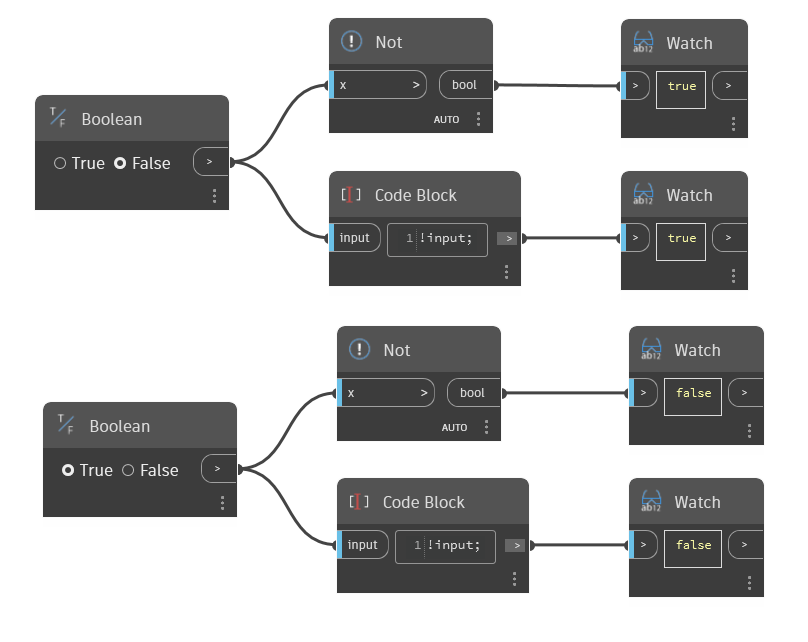

## In profondità
Il nodo `Not` restituisce l'opposto di un valore booleano input. Il nodo Not viene indicato anche come `!` (punto esclamativo) in DesignScript e converte True in False e viceversa.

Nell'esempio seguente, i nodi `Not` vengono utilizzati per scambiare gli input booleani con il loro opposto. L'esempio illustra inoltre l'utilizzo di un Code Block con `!input` per invertire il valore booleano.
___
## File di esempio

