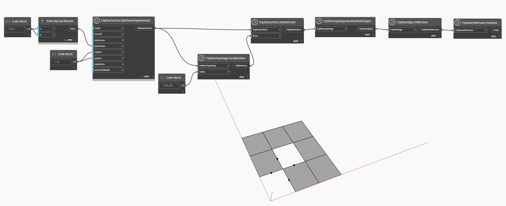

<!--- Autodesk.DesignScript.Geometry.TSpline.TSplineTopology.NonManifoldEdges --->
<!--- RTIWDKESEBH6BZLFB4NRIVBLFZ72VYNZW4TBWEI6EEYG22TE6NBA --->
## In-Depth
 Il nodo `TSplineTopology.NonManifoldEdges` identifica i bordi non manifold da una superficie T-Spline. Una superficie non manifold può essere visualizzata solo in modalità riquadro fino a quando non viene riparata.

Nell'esempio seguente, una superficie T-Spline non manifold viene creata come risultato dell'eliminazione di facce su una superficie del piano. I nodi `TSplineTopology.NonManifoldEdges` e `TSplineUVNFrame.Position` vengono utilizzati per identificare e visualizzare i bordi non manifold.

## File di esempio

