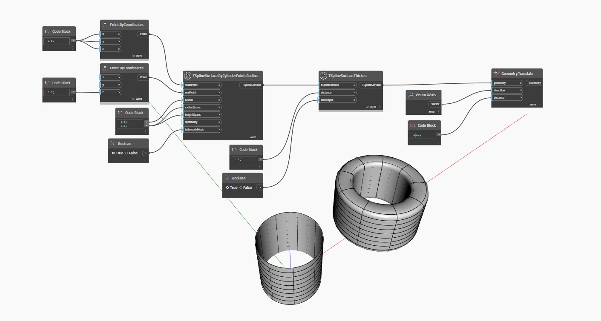

## In profondità
`TSplineSurface.Thicken(distance, softEdges)` ispessisce una superficie T-Spline verso l'esterno (o verso l'interno, quando viene fornito un valore `distance` negativo) di un valore `distance` specificato lungo le normali delle facce. L'input booleano `softEdges` controlla se i bordi risultanti sono lisciati (true) o triangolati (false).

Nell'esempio seguente, viene ispessita una superficie cilindrica T-Spline utilizzando il nodo `TSplineSurface.Thicken(distance, softEdges)`. La superficie risultante viene traslata sul lato per una migliore visualizzazione.
___
## File di esempio

