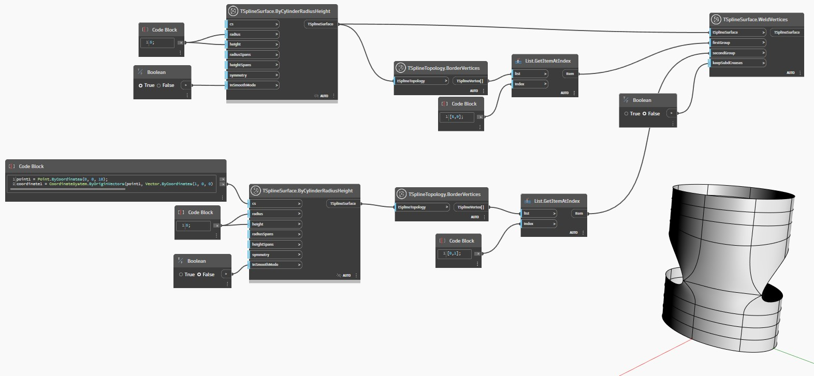

## In profondità
Nell'esempio seguente, due superfici cilindriche T-Spline sono posizionate una sopra l'altra. Due vertici sono selezionati da ciascuna superficie e utilizzati come input per il nodo `TSplineSurface.WeldVertices`. Il gruppo di vertici fornito come input `firstGroup` rimane in posizione mentre `secondGroup` dei vertici viene spostato per eseguire l'operazione di saldatura. Facoltativamente, l'input `keepSubdCreases` controlla se il bordo lungo la saldatura viene triangolato.
___
## File di esempio

