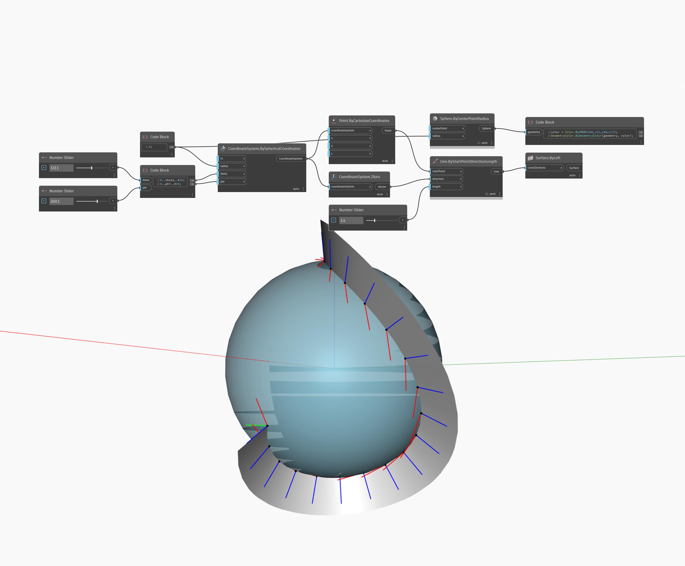

<!--- Autodesk.DesignScript.Geometry.CoordinateSystem.BySphericalCoordinates --->
<!--- UYY33O65ZLXAIX5KFQN2EYDM2O5XLAGJFC4EWEKGUHZDIXLTI5BA --->
## In profondità
Il nodo Point.ByCylindricalCoordinates crea un punto all'interno di uno spazio sferico. In questo caso, si imposta il collegamento su Globale e si utilizza un intervallo di angoli phi e teta per generare una griglia di punti lungo un cilindro con un raggio dinamico. La posizione della sfera è impostata su un sistema di coordinate con origine (1, 5, 1).
___
## File di esempio

