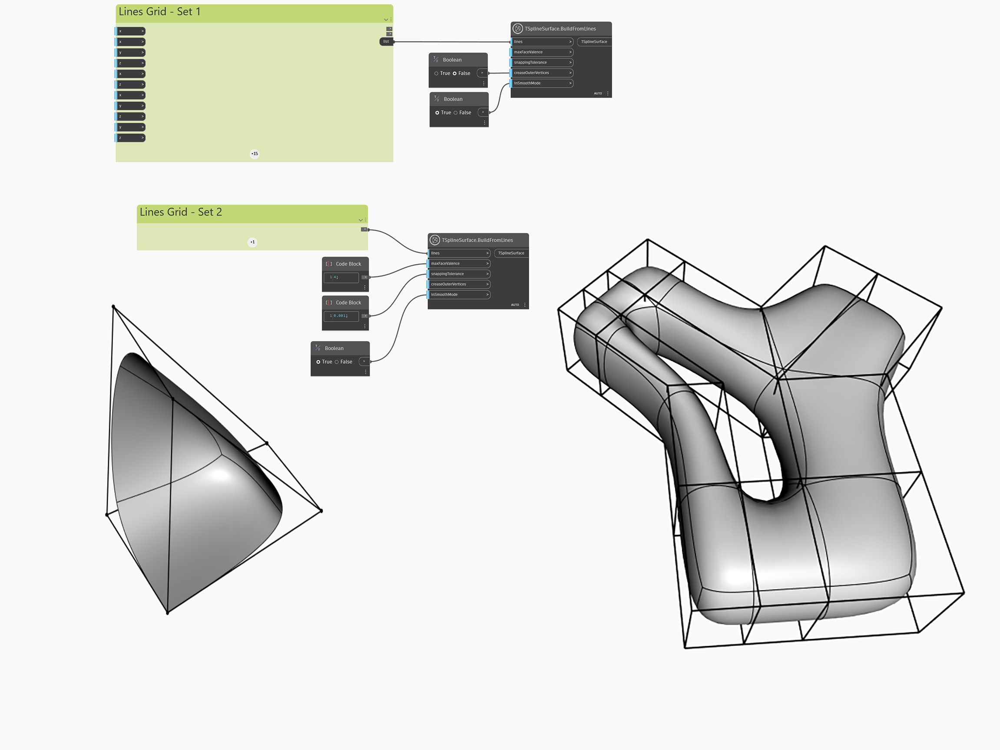

<!--- Autodesk.DesignScript.Geometry.TSpline.TSplineSurface.BuildFromLines --->
<!--- UZBX3TZTQ23FP32HELAYI7UOVGU7J6ACDZ5C3DTCYCIVJOHYWCCQ --->
## In profondità
`TSplineSurface.BuildFromLines` consente di creare una superficie T-Spline più complessa che può essere utilizzata come geometria finale o come primitiva personalizzata più vicina alla forma desiderata rispetto alle primitive di default. Il risultato può essere una superficie chiusa o aperta e può includere fori e/o bordi triangolati.

L'input del nodo è un elenco di curve che rappresentano una "gabbia di controllo" per la superficie T-Spline. L'impostazione dell'elenco di linee richiede una certa preparazione e deve seguire determinate linee guida.
- le linee non devono sovrapporsi
- il bordo del poligono deve essere chiuso e ogni punto finale della linea deve incontrare almeno un altro punto finale. Ogni intersezione della linea deve incontrarsi in un punto.
- è necessaria una densità maggiore di poligoni per le aree con maggiore dettaglio
- i quadrilateri sono preferiti ai triangoli e ai numeri perché sono più facili da controllare.

Nell'esempio seguente, vengono create due superfici T-Spline per illustrare l'utilizzo di questo nodo. `maxFaceValence` viene lasciato al valore di default per entrambi i casi e `snappingTolerance` viene regolato per garantire che le linee entro il valore di tolleranza vengano trattate come unite. Per la forma a sinistra, `creaseOuterVertices` è impostato su False per mantenere due vertici degli angoli nitidi e non arrotondati. La forma a sinistra non presenta vertici esterni e questo input viene lasciato al valore di default. `inSmoothMode` viene attivato per entrambe le forme per un'anteprima uniforme.

___
## File di esempio

