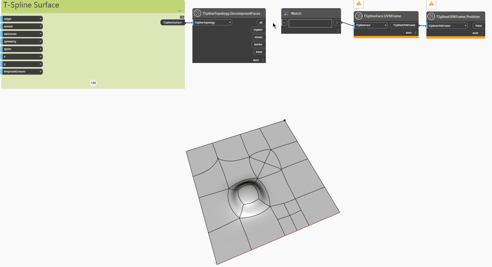

<!--- Autodesk.DesignScript.Geometry.TSpline.TSplineTopology.DecomposedFaces --->
<!--- VIA3XNZWZWW3XHWL222NGHWM22VLSA4QXMZCPWZ6JO6G3P7H2WGA --->
## In profondità
Nell'esempio seguente, una superficie T-Spline piana con facce e vertici estrusi, suddivisi ed estratti viene ispezionata con il nodo `TSplineTopology.DecomposedFaces`, che restituisce un elenco dei seguenti tipi di facce contenuti nella superficie T-Spline:

- `all`: elenco di tutte le facce
- `regular`: elenco delle facce regolari
- `nGons`: elenco di facce NGon
- `border`: elenco di facce dei bordi
- `inner`: elenco di facce interne

I nodi `TSplineFace.UVNFrame` e `TSplineUVNFrame.Position` vengono utilizzati per evidenziare i diversi tipi di facce della superficie.
___
## File di esempio

