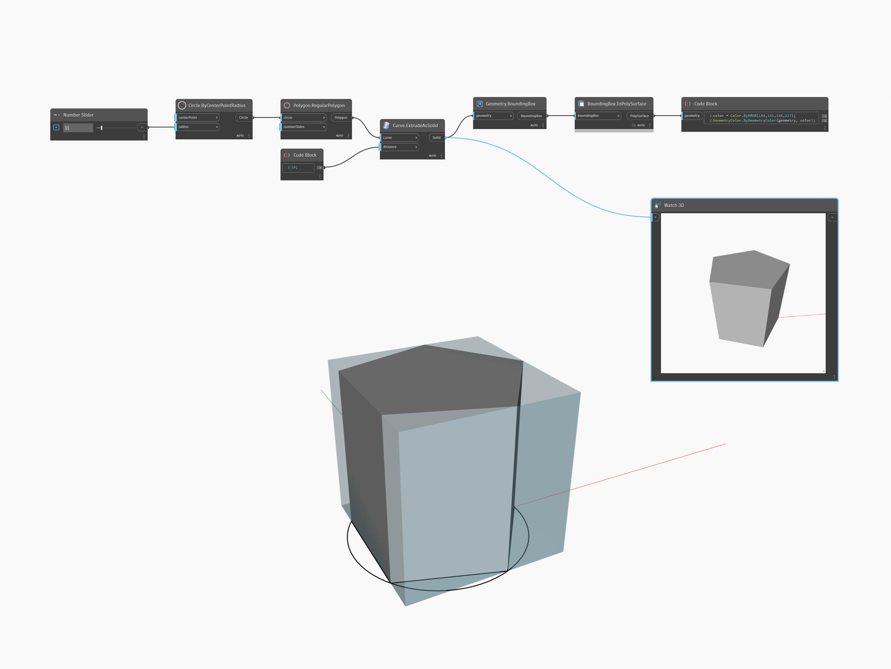

## In profondità
Watch 3D consente di visualizzare l'anteprima dell'output della geometria di un nodo in una nuova finestra dell'area di lavoro. Nell'esempio seguente, viene visualizzata l'anteprima di un solido nel nodo Watch3D mentre viene visualizzata l'anteprima del relativo riquadro di delimitazione PolySurface nell'area di lavoro.
___
## File di esempio

