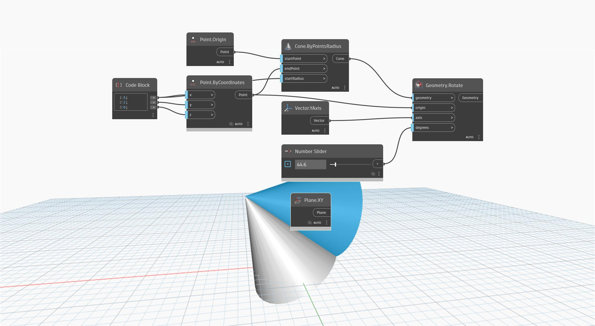

<!--- Autodesk.DesignScript.Geometry.Geometry.Rotate(geometry, origin, axis, degrees) --->
<!--- Z62AE2MAWASIXXZ7HW3OJ37OGY24A3M2KOTCHO7DR52NRIL2JQCA --->
## In profondità
`Geometry.Rotate (origin, axis, degrees)` ruota una geometria di input attorno ad un piano di base di un grado definito.

Nell'esempio seguente, un cono viene ruotato attorno al piano XY con un dispositivo di scorrimento numerico.

___
## File di esempio

