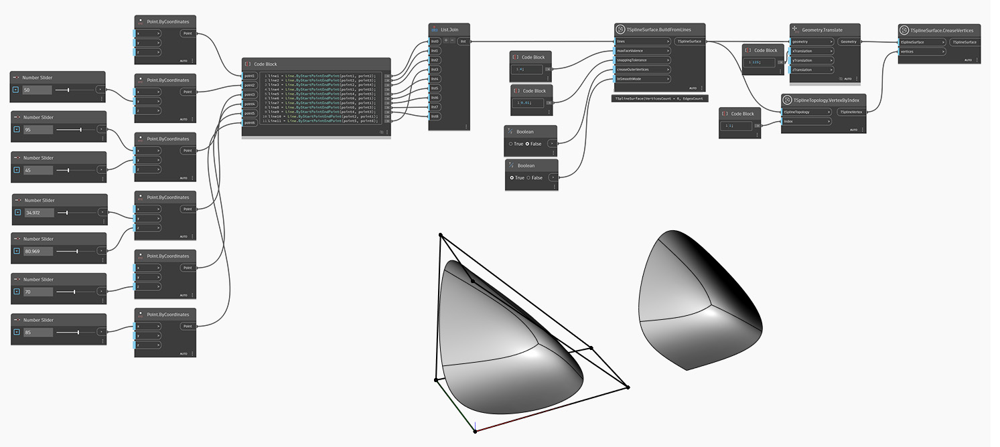

<!--- Autodesk.DesignScript.Geometry.TSpline.TSplineSurface.CreaseVertices --->
<!--- ZLORG7PG4XWDBYXJHH7YVPDCIU4QYMZWAMABFPVWNAZ7VTQTX2YQ --->
## In-Depth
Nell'esempio seguente, viene creata una forma con bordi non triangolati utilizzando il nodo `TSplineSurface.BuildFromLines` e impostando l'input `creaseOuterVertices` su False. Il vertice con l'indice 1 viene quindi triangolato utilizzando il nodo `TSplineSurface.CreaseVertices` e la forma viene traslata a destra per una migliore vista.

## File di esempio

