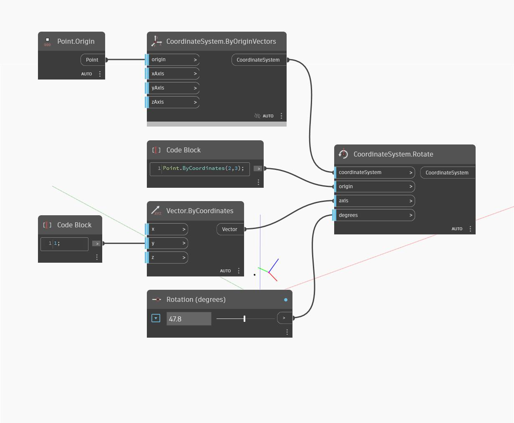

<!--- Autodesk.DesignScript.Geometry.CoordinateSystem.Rotate(origin, axis, degrees) --->
<!--- 3JO6UW566EG3MSCU25AGJTTDKZSMAZZO7D4VC5APLFDZVUEMPDSA --->
## 詳細
角度を指定して、原点と軸を中心に座標系を回転します。
___
## サンプル ファイル

