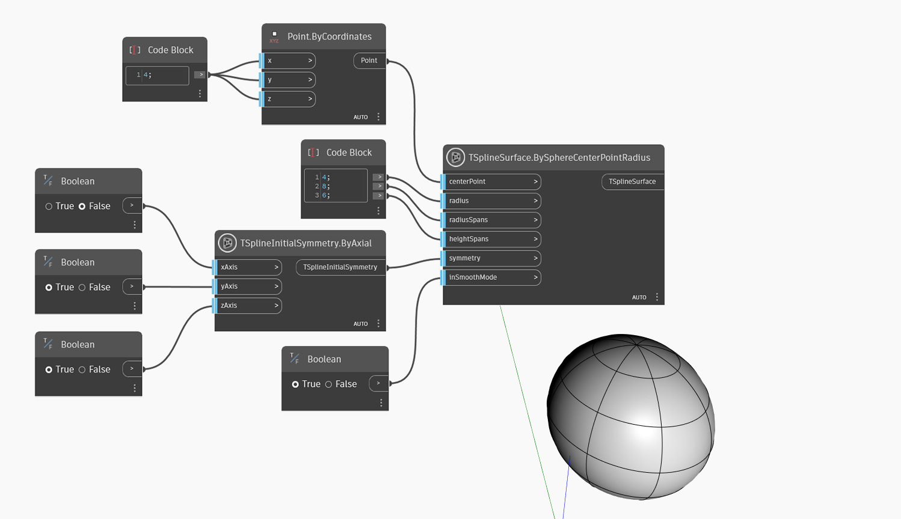

<!--- Autodesk.DesignScript.Geometry.TSpline.TSplineSurface.BySphereCenterPointRadius --->
<!--- 3W2XHZKQEZFB7P3OTUVOZUMCD3M7PKUFQZI42URWMPFARFIN2NVQ --->
## 詳細
次の例では、`TSplineSurface.BySphereCenterPointRadius` ノードを使用して T スプライン球体のプリミティブ サーフェスを作成します。`centerPoint` 入力は球体の原点を定義し、`radius` はサイズを指定します。`radiusSpans` 入力と `heightSpans` 入力は、高さスパンと放射状のスパン(子午線)に沿った面の数をコントロールします。`symmetry` は形状に初期対称性があるかどうかをコントロールし、最後に `inSmoothMode` は、プレビューがスムーズ モードかボックス モードかを定義します。

## サンプル ファイル

