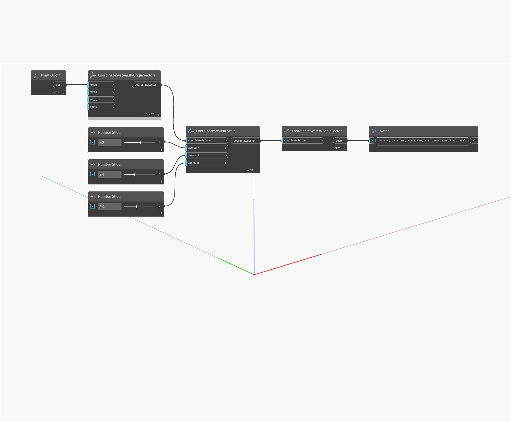

<!--- Autodesk.DesignScript.Geometry.CoordinateSystem.Scale(xamount, yamount, zamount) --->
<!--- 5IXBOJ4T7DGQ4FYV7OJBRP77VS7URLKC6BUG7AUFBR6QSPUYOFIA --->
## 詳細
原点を中心に座標系を不均等にスケールします。
___
## サンプル ファイル

