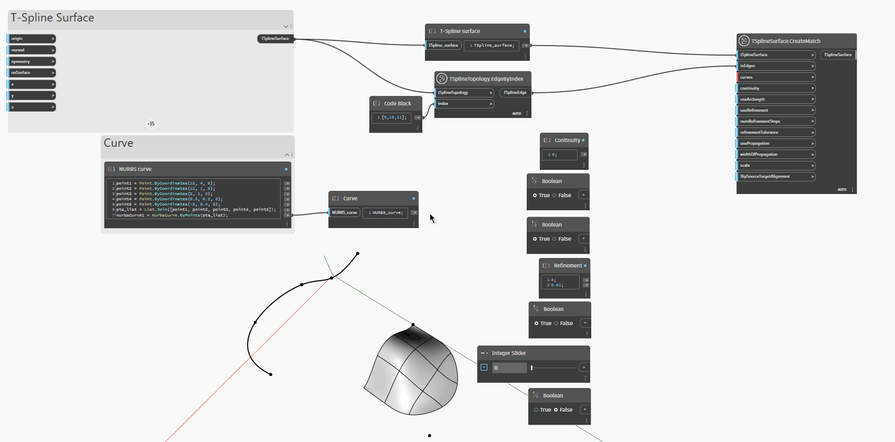

## 詳細

次の例では、T スプライン サーフェスを NURBS 曲線と一致させるために、
`TSplineSurface.CreateMatch (tSplineSurface, tsEdges, curves)` ノードを使用しています。このノードに必要な
最小限の入力は、ベース `tSplineSurface`、`tsEdges` 入力に指定されるサーフェスのエッジのセット、および曲線または
曲線のリストです。
次の入力で、一致のパラメータをコントロールします。
- `continuity` では、一致の連続性タイプを設定できます。入力には、G0 位置連続性、G1 接線連続性、G2 曲率連続性に対応する値 0、1、2 を使用します。ただし、サーフェスを曲線と一致させる場合は、G0 (入力値 0)のみを使用できます。
- `useArcLength` は位置合わせタイプのオプションをコントロールします。True に設定すると、
使用される位置合わせタイプは弧長になります。この位置合わせでは、T スプライン サーフェスの各点と曲線上の対応する点の間の
物理的な距離が最少化されます。False 入力が指定されると、位置合わせタイプはパラメータ制御になり、
T スプライン サーフェス上の各点は、一致ターゲット曲線上の、互換性のあるパラメータで指定した距離の点と
一致します。
- `useRefinement` を True に設定すると、指定された `refinementTolerance` 内でターゲットに一致するように
サーフェスに制御点を追加します
- `numRefinementSteps` は、`refinementTolerance` に達しようとする間にベース T スプライン サーフェスが
再分割される最大回数です。`useRefinement` が False に設定されていると `numRefinementSteps` と `refinementTolerance` はどちらも無視されます。
- `usePropagation` は、一致によるサーフェスの影響の度合いをコントロールします。False に設定すると、サーフェスへの影響は最小限になります。True に設定すると、サーフェスは指定された `widthOfPropagation` 距離内で影響を受けます。
- `scale` は接線スケールで、G1 連続性と G2 連続性の結果に影響を与えます。
- `flipSourceTargetAlignment` は位置合わせ方向を反転します。

## サンプル ファイル

