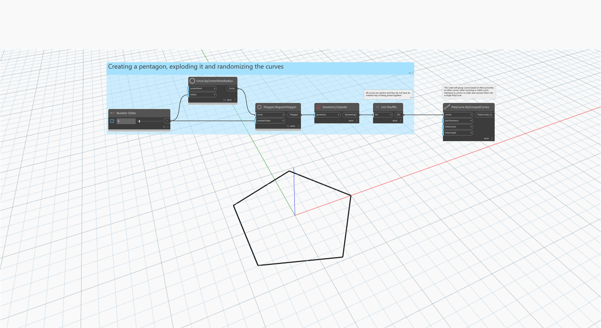

<!--- Autodesk.DesignScript.Geometry.PolyCurve.ByGroupedCurves(curves, joinTolerance, trimCurves, trimLength) --->
<!--- 6Z5ORNUUOKVQFG6ZBYHMWKQR457NCZXFTI27PNFF3MSQGVPTVZ2A --->
## 詳細
`PolyCurve.ByGroupedCurves` は、複数の接続された曲線をグループ化して新しい PolyCurve を作成します。曲線を他の曲線との近接度(指定された結合の許容値内で接触または近接しているか)に基づいてグループ化し、単一の PolyCurve に接続します。

次の例では、五角形を分解し、その曲線をランダム化します。`PolyCurve.ByGroupedCurves` を使用して、これらを単一の PolyCurve にグループ化します。
___
## サンプル ファイル

