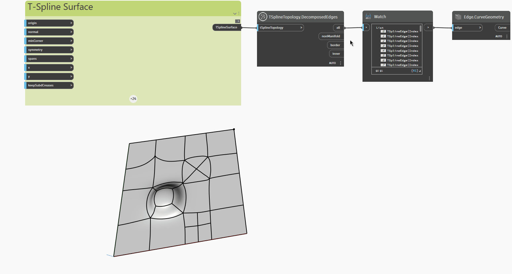

<!--- Autodesk.DesignScript.Geometry.TSpline.TSplineTopology.DecomposedEdges --->
<!--- 7LMFKLQNCV53W7KLS5QWD3E27NGGA33QPHSXMUGH323WVXWJY3GQ --->
## 詳細
次の例では、押し出され、再分割され、プルされた頂点と面を持つ平面 T スプライン サーフェスが `TSplineTopology.DecomposedEdges` ノードで検査され、T スプライン サーフェスに含まれる次のタイプのエッジのリストを返します。

- `all`: すべてのエッジのリスト
- `nonManifold`: 非多様体エッジのリスト
- `border`: 境界エッジのリスト
- `inner`: 内側のエッジのリスト

ノード `Edge.CurveGeometry` は、サーフェスのさまざまなタイプのエッジをハイライト表示するために使用されます。
___
## サンプル ファイル

