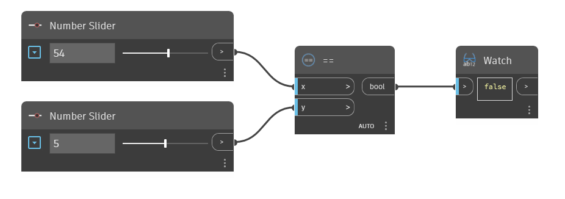

## 詳細
`==` ノードは等号演算子です。`x` の入力値が `y` の入力値と等しい場合は True を返します。2 つの値が等しくない場合は False を返します。このノードは、文字列、Revit オブジェクト、ジオメトリなど、数値と非数値の両方を比較するために使用できます。

次の例では、`==` ノードを使用して、x と y の入力値が等しいかどうかを判断します。2 つの数値スライダを使用して、`==` 演算子への入力をコントロールします。
___
## サンプル ファイル

