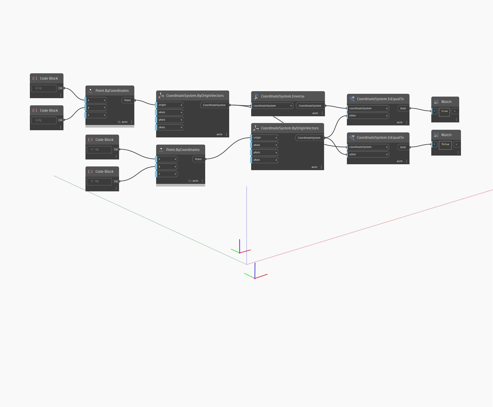

## 詳細
Inverse は、入力から反転した CoordinateSystem を返します。次の例では、(1,2,0)にある CoordinateSystem が(-1,-2,0)の CoordinateSystem に反転されています。それぞれの CoordinateSystem に描画されたジオメトリはワールド座標系の原点に対して逆向きになります。
___
## サンプル ファイル

