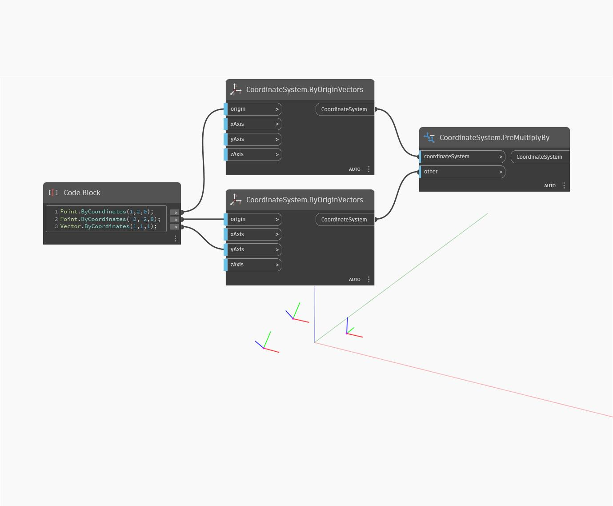

## 詳細
PreMultiplyBy は、他(引数)の CoordinateSystem を CoordinateSystem で乗算して新しい CoordinateSystem を返します。次の例では、乗算された CoordinateSystem およびその引数に応じて移動および回転された新しい CoordinateSystem が返されています。このノードは PostMultiplyBy ノードに似ていますが、other 入力が coordinatesystem 入力の前に適用されることのみ異なります。
___
## サンプル ファイル

