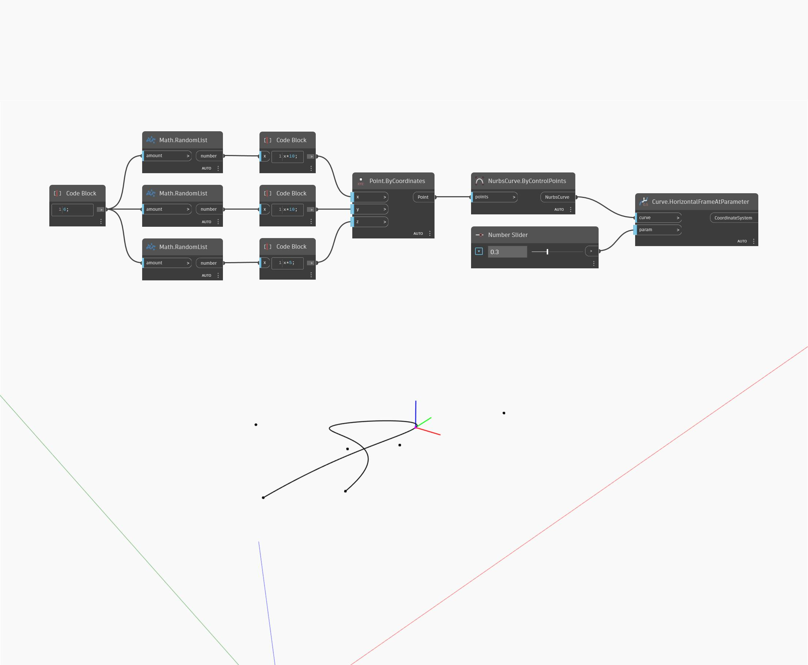

## 詳細
HorizontalFrameAtParameter は、指定されたパラメータの位置における、入力された曲線に位置合わせされた座標系を返します。曲線はパラメータ化されて、0 ～ 1 の範囲で計測され、0 が曲線の始点、1 が終点を表します。結果の座標系の Z 軸は、ワールド座標系の Z 軸方向、Y 軸は指定されたパラメータの位置における曲線の接線方向となります。次の例では、まず ByControlPoints ノードで、ランダムに生成された点のセットを入力として使用して NurbsCurve を作成します。範囲が 0 ～ 1 に設定された数値スライダを使用して、HorizontalFrameAtParameter ノードのパラメータの入力をコントロールしています。
___
## サンプル ファイル

