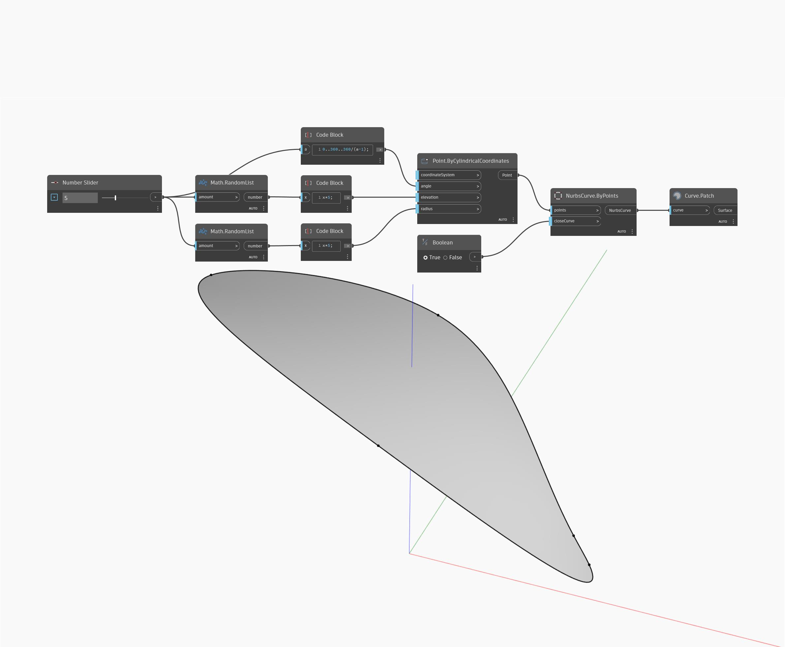

## 詳細
Patch は、入力された曲線を境界として使用してサーフェスを作成しようとします。入力された曲線は閉じている必要があります。次の例では、まず Point.ByCylindricalCoordinates ノードを使用して、間隔が一定で高さと半径はランダムな点のセットを、輪になるように作成します。次に、NurbsCurve.ByPoints ノードを使用して、この点群に基づいて閉じた曲線を作成します。Patch ノードを使用して、境界となる閉じた曲線からサーフェスを作成します。点群はランダムな半径および高さで作成されたため、すべての配置でパッチできる曲線が作成されるわけではありません。
___
## サンプル ファイル

