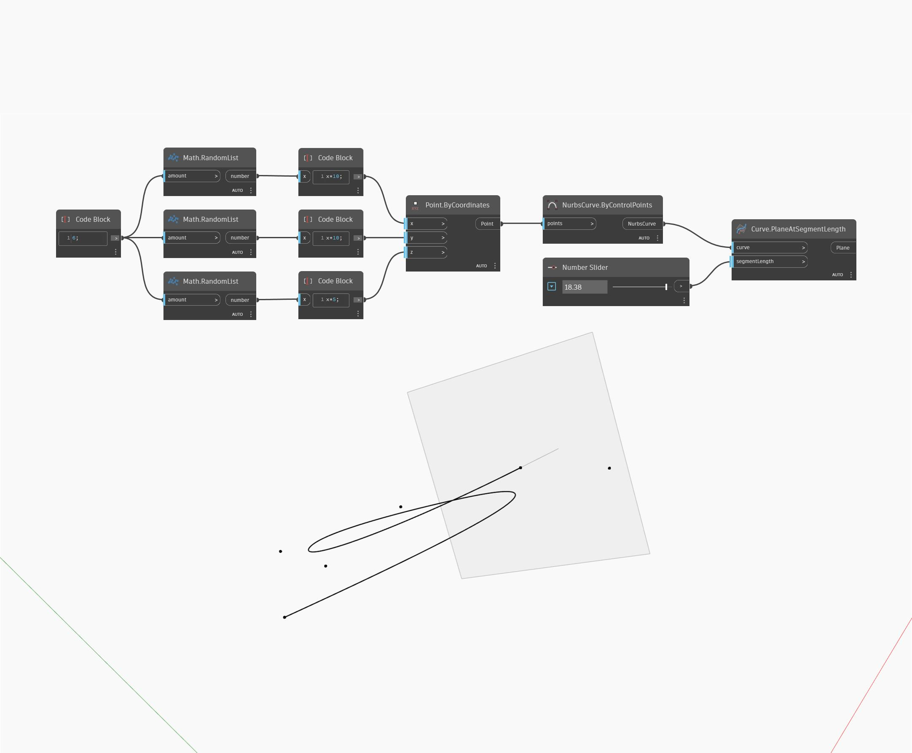

## 詳細
PlaneAtSegmentLength は、曲線上の指定された距離(始点から計測)にある点における、曲線に位置合わせされた平面を返します。入力された長さが曲線の全長よりも長い場合、このノードは曲線の終点を使用します。結果の平面の法線ベクトルは曲線の接線に対応します。次の例では、まず ByControlPoints ノードで、ランダムに生成された点のセットを入力として使用して NurbsCurve を作成します。数値スライダを使用して、PlaneAtSegmentLength ノードのパラメータの入力をコントロールしています。
___
## サンプル ファイル

