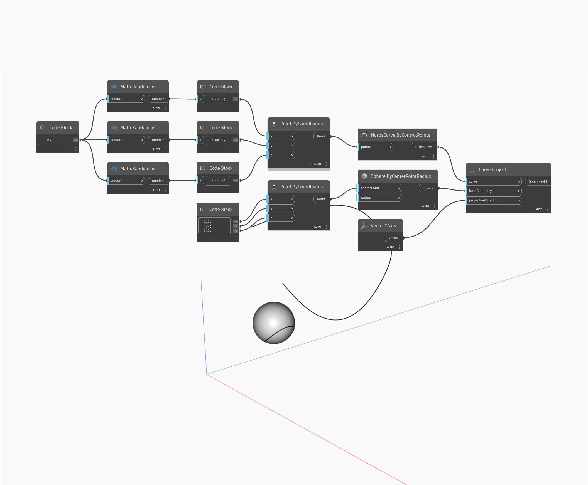

## 詳細
Project は、入力されたベクトル方向に沿って指定されたジオメトリ上に点を投影します。ベクトルの正の方向にのみ投影されます。ベクトルが指定されたジオメトリと交差しない場合は、NULL を返します。次の例では、コード ブロックを使用して X、Y、Z 座標を指定することで点を作成します。投影先のジオメトリとして球を使用し、ワールド座標系の XAxis を projectionDirection として使用します。出力は元の点から投影された、球のサーフェス上の点です。
___
## サンプル ファイル

