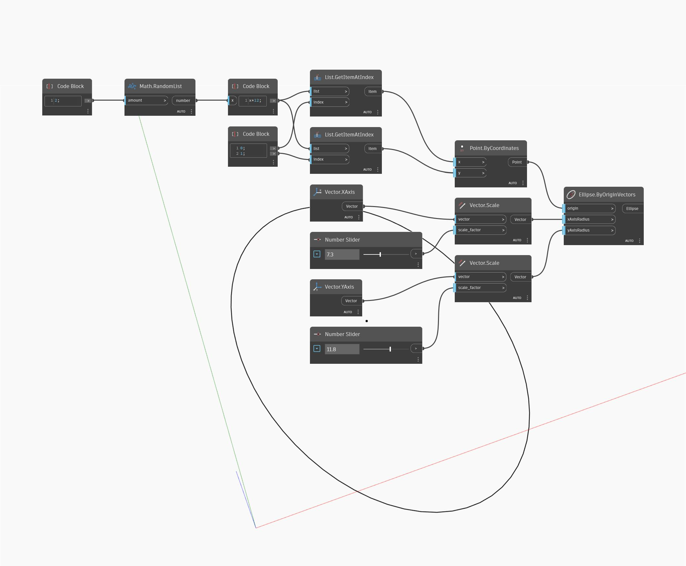

## 詳細
Ellipse.ByOriginVectors は、入力された原点を中心とする楕円を作成します。このノードの場合は、XAxisRadius と YAxisRadius に入力としてベクトルが必要です。2 つのベクトルは互いに直交する(直角になる)必要があります。2 つのベクトルによって楕円の平面が決まります。ワールド座標系の X 方向と Y 方向である必要はありません。次の例では、まず 2 つのランダムな数値を生成して原点を作成します。次に X 方向の単位ベクトルと Y 方向の単位ベクトルを使用し、スケールを数値スライダで変更しています。
___
## サンプル ファイル

