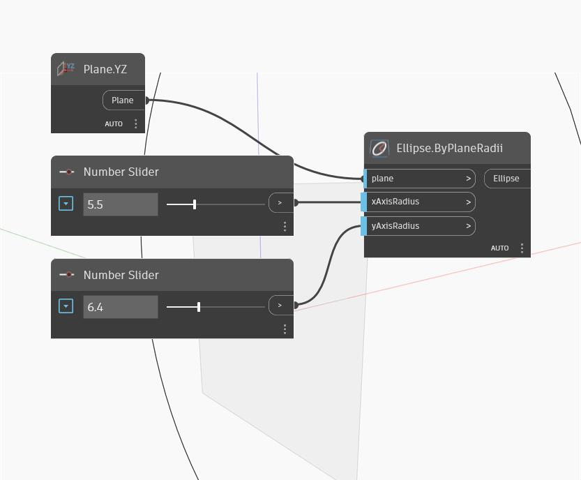

## 詳細
Ellipse.ByPlaneRadii は、入力された平面を中心とする楕円を作成します。xAxisRadius と yAxisRadius は入力として数値を取得し、入力された平面の X 方向と Y 方向に対応します。この方向はワールド座標系の X 方向と Y 方向とは異なる場合があります。次の例では、入力として YZ 平面を使用し、xAxisRadius と yAxisRadius には 2 つの数値スライダを使用します。YZ 平面を使用したため、xAxisRadius はワールド座標系の Y 方向に対応し、yAxisRadius はワールド座標系の Z 方向に対応しています。
___
## サンプル ファイル

