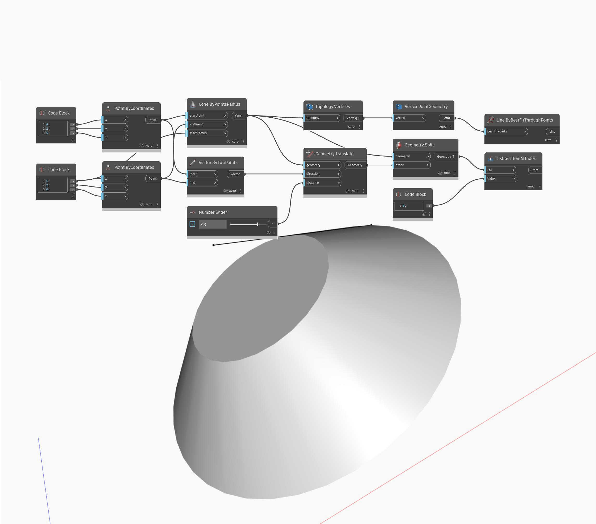

## 詳細
Geometry.Split ノードには、Geometry.Trim ノードと同様の機能があります。このノードは、Tool (別の Geometry をトリムする任意のタイプの Geometry)と Geometry を入力し、Geometry のすべてのフラグメントを返します。次の例では、Cone に類似の Cone を使用して Split を実行します。すべてのフラグメントが Geometry.Split ノードによって返されますが、このサンプル ファイルでは、1 つがプレビューされています。
___
## サンプル ファイル

