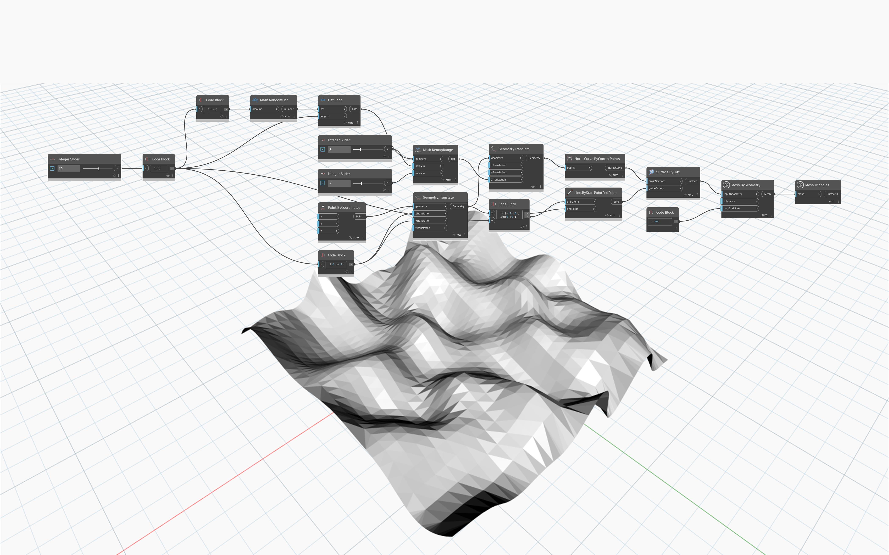

## 詳細
`Mesh.ByGeometry` は、Dynamo のジオメトリ オブジェクト(サーフェスやソリッド)を入力として受け取り、メッシュに変換します。点と曲線はメッシュ表現を持たないため、有効な入力ではありません。変換で生成されるメッシュの解像度は、`tolerance` と `maxGridLines` の 2 つの入力によってコントロールされます。`tolerance` はメッシュと元のジオメトリとの許容可能な偏差を設定し、メッシュのサイズに依存します。`tolerance` の値を -1 に設定すると、Dynamo は適切な許容値を選択します。`maxGridLines` 入力は、U 方向または V 方向の最大通芯数を設定します。通芯の数が多いほど、テッセレーションの滑らかさが向上します。

## サンプル ファイル

