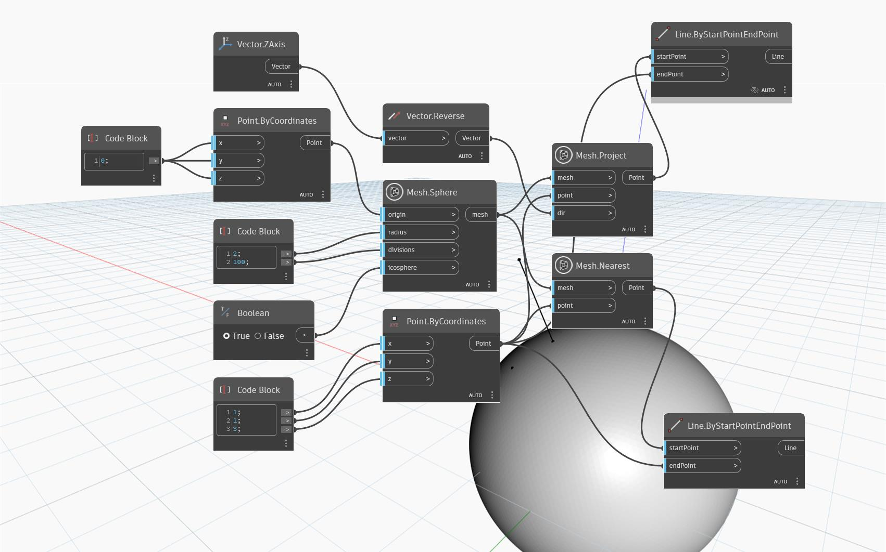

## 詳細
`Mesh.Nearest` は、入力されたメッシュにおける、指定された点に最も近い点を返します。返される点は、入力された点をメッシュ上に投影したものです。この投影は、点からメッシュへ向かう法線ベクトルを使用して行われ、可能な限り近い点を取得できます。

次の例では、ノードがどのように機能するかを示すために、簡単なユースケースを作成しています。入力された点は球状のメッシュの上部にありますが、真上ではありません。結果として得られる点は、メッシュ上にある最も近い点になります。一方、`Mesh.Project` ノードの出力(同じ点とメッシュを入力として使用し、負の 'Z' 方向のベクトルを使用)では、結果として得られる点は入力された点の真下のメッシュ上に投影されます。`Line.ByStartAndEndPoint` は、メッシュに投影された点の「軌道」を表示するために使用されます。

## サンプル ファイル

